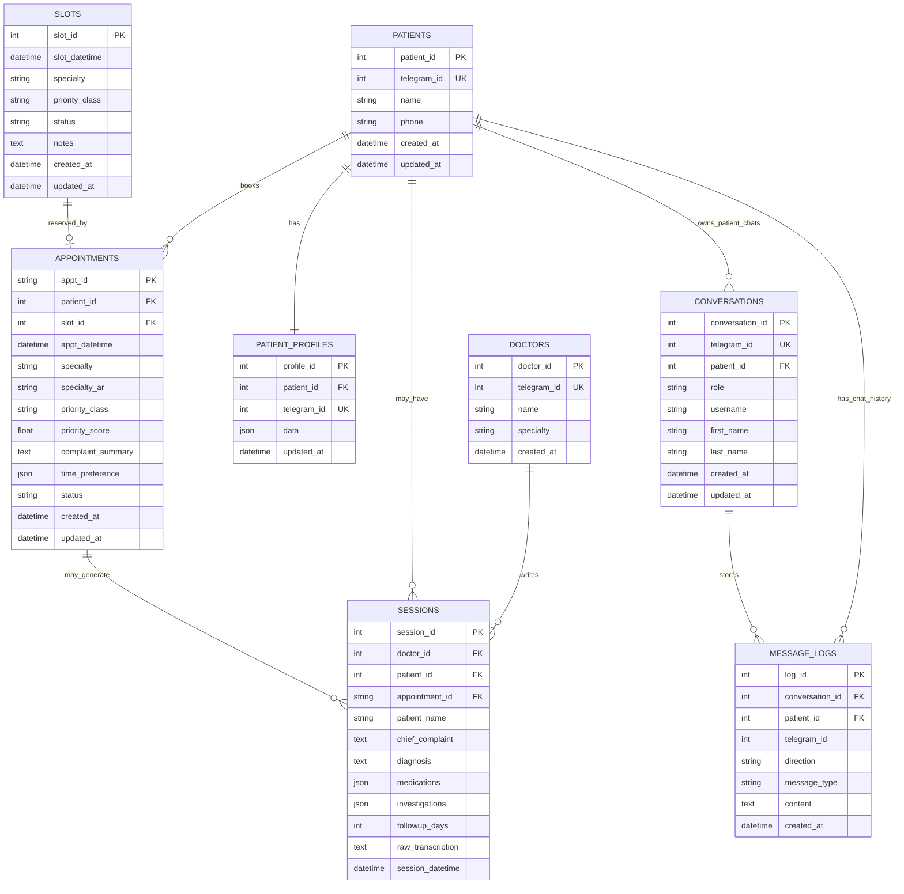
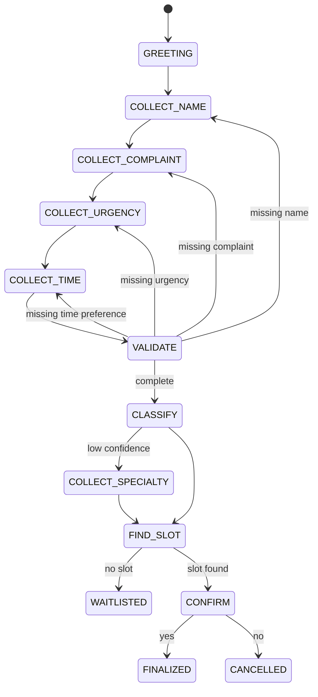
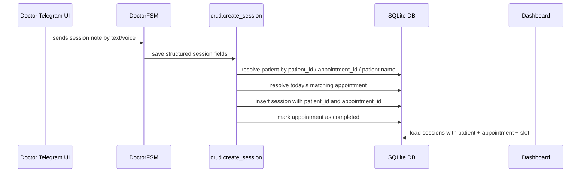
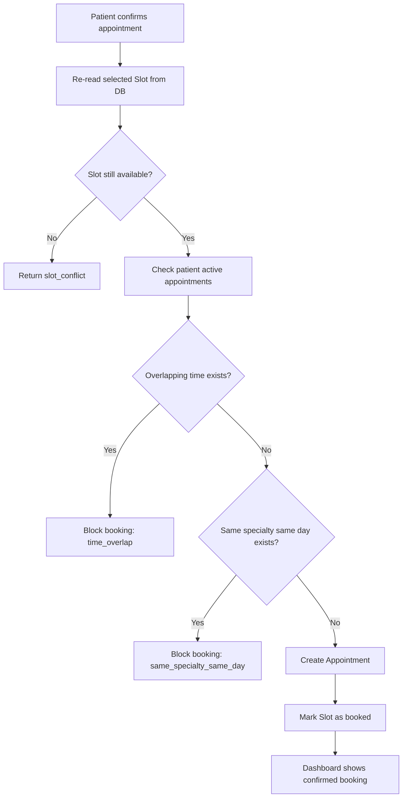
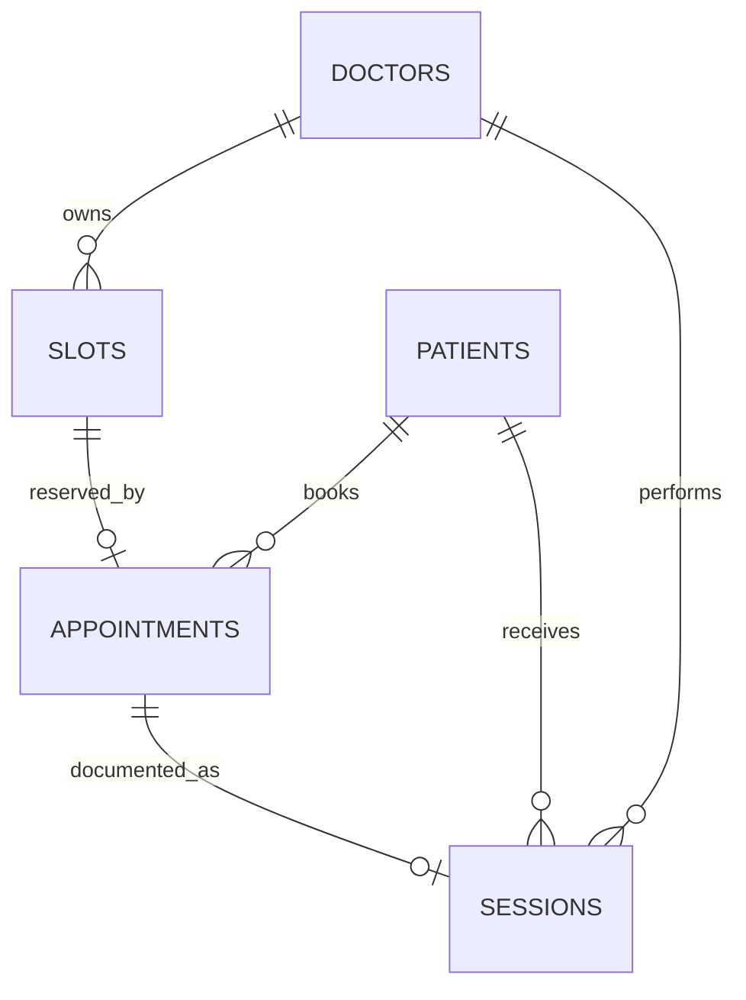

# ClinicAI — Theory Design Notes

## 1. ERD for the whole app



### Important conversation-patient linking rule

The chat records must be linked to the patient whenever the Telegram user is a patient. In practice, the conversation may start before the patient profile exists, so the system stores the first messages by `telegram_id` first. Once the FSM creates the patient record, it attaches:

- `conversations.patient_id -> patients.patient_id`
- `message_logs.patient_id -> patients.patient_id`
- `message_logs.conversation_id -> conversations.conversation_id`

This keeps the full booking conversation visible from the patient record and makes the Dashboard clinically useful instead of showing isolated Telegram IDs only.

## 2. Priority engine: from conversation to score

The FSM collects complaint, patient-stated urgency, whether this is a follow-up, target clinic/specialty, and time preference.
The engine maps these into five features:

| Feature | Weight | Meaning |
|---|---:|---|
| complaint | 0.35 | Risk signal from symptoms and red flags |
| urgency | 0.25 | Patient's stated urgency |
| followup | 0.15 | Existing clinic relationship / follow-up |
| specialty | 0.15 | Clinical urgency of the specialty |
| timing | 0.10 | How soon the patient wants to be seen |

Thresholds:

| Class | Score |
|---|---|
| P1 | score >= 0.68 |
| P2 | score >= 0.38 |
| P3 | score < 0.38 |

## 3. FSM checklist loop



## 4. Scheduling engine

The scheduler reads `slots` where `status='available'`, filters by `specialty`, optional `preferred_date`, and priority reservation.

Policy:

- P1 can use P1, P2, P3, or unreserved slots.
- P2 can use P2, P3, or unreserved slots, but not P1-reserved slots.
- P3 can use P3 or unreserved slots.
- Exact clinic/specialty is tried first.
- If specialty capacity is full, `general_practice` is used as fallback.
- Final confirmation re-reads the slot from DB and only books if still available.
- When booked, appointment is inserted and slot becomes `booked`.
- If cancelled, the slot is released back to `available`.

## 5. Dashboard design

Dashboard pages:

- Home queue: today's confirmed queue with live refresh.
- Appointments: full day schedule, complaint, priority score, and slot status.
- Patients: patient search and appointment count.
- Conversations: Telegram user conversations.
- Logs: raw inbound/outbound messages.
- Sessions: doctor notes after clinical visit.

## 6. Server connecting components

`main.py` starts:

1. `init_db()` to create/migrate tables and seed demo slots.
2. FastAPI dashboard in a background thread.
3. Telegram bot polling in the main thread.

## 7. Speech recognition

Patient or doctor voice messages flow through:

Telegram voice OGG → download bytes → `voice/stt.py` → ffmpeg conversion → Whisper transcription → text goes into the same FSM as normal text.

## 8. Speech generation

`voice/tts.py` uses Edge TTS with Arabic Palestinian voice and converts responses to Telegram-compatible OGG.
This is ready for voice replies, although the current patient handler replies by text.

## 9. Telegram buttons

Reply keyboard buttons are used for:

- urgency
- preferred appointment time
- confirmation
- specialty choice when classification is uncertain
- main patient menu

## 10. Patient clinic classification

The classifier uses rule-based Arabic symptom matching first.
If no confident match is found, the FSM asks the patient to select the closest specialty using buttons.

## 11. V3 relationship completion: doctor sessions

V3 completes the clinical-documentation side of the ERD. In V2, `sessions.patient_id` and `sessions.appointment_id` existed as foreign-key columns, but the ORM relationship layer was not complete. V3 adds full SQLAlchemy relationships:

```text
Patient.sessions      ↔ Session.patient
Appointment.sessions  ↔ Session.appointment
Doctor.sessions       ↔ Session.doctor
```

### Practical workflow



### Why this matters

The project now covers the full patient journey:

1. Patient chats with the bot.
2. FSM creates patient profile and appointment.
3. Appointment reserves a slot.
4. Doctor records the clinical session.
5. Session links back to the patient and appointment.
6. Dashboard shows the visit as a completed clinical record, not an isolated note.

### Matching rule for doctor sessions

When saving a doctor session, the system resolves links using this order:

1. If `appointment_id` exists, use it directly.
2. Else if `patient_id` exists, use the patient directly.
3. Else match `patient_name` from the doctor's note against `patients.name`.
4. Prefer today's confirmed/arrived/completed appointment for that patient.
5. If no appointment today exists, use the latest non-cancelled appointment.
6. If no match exists, still save the session but mark it as unlinked so it can be reviewed later.

---

## 12. V4 scheduling rule: duplicate and overlapping appointment prevention

### Problem solved
The V3 booking logic prevented two users from taking the same slot, but it did not fully prevent the same patient from booking medically unrealistic appointments.

### V4 policy

1. **Same patient + overlapping time = blocked**
   - The patient cannot have two active appointments at the same time, even if the specialties are different.
   - This prevents cases such as cardiology at 10:00 and dermatology at 10:00.

2. **Same patient + same specialty + same day = blocked**
   - The patient cannot book two active appointments for the same specialty/clinic on the same day.
   - This prevents duplicate bookings for the same clinical purpose.

3. **Same patient + different specialties + different non-overlapping times = allowed**
   - The patient can see two different clinics on the same day if the appointments are sequential and not overlapping.
   - Example: cardiology at 10:00 and dermatology at 10:30 is allowed.

### Active appointment statuses
Only these statuses block a new booking:

```text
confirmed
arrived
waitlisted
```

Statuses such as `cancelled`, `completed`, and `no_show` do not block future bookings.

### Updated booking flow



### Final behavior examples

| Scenario | V4 behavior |
|---|---|
| Same patient books cardiology 10:00 and cardiology 10:30 same day | Blocked |
| Same patient books cardiology 10:00 and dermatology 10:00 same day | Blocked |
| Same patient books cardiology 10:00 and dermatology 10:30 same day | Allowed |
| Different patients book the same slot | Blocked by slot status |
| Patient cancels an appointment then books another | Allowed after cancellation |

## 13. Complete V4: doctor-owned clinics, slots, dashboard sessions, and active TTS

### Doctor as clinic resource

The application uses one `doctors` table. Each doctor represents one clinic/specialty and owns many scheduling slots:



Eight doctors are seeded with `name`, `specialty`, `clinic_code`, and `clinic_name`. `telegram_id` is optional and is only used when a doctor explicitly uses the Telegram doctor interface.

### Slot retrieval

The scheduling engine now searches active doctors by specialty and returns only slots owned by the matching doctor/clinic. The selected slot supplies the doctor and clinic shown to the patient and dashboard.

### Dashboard session entry

A clinical session can be registered from the dashboard using an existing appointment. The backend derives:

```text
Appointment -> Slot -> Doctor
Appointment -> Patient
```

It then creates the session, links it to the doctor/patient/appointment, and marks the appointment as `completed`. No doctor Telegram ID is required.

### Patient voice and TTS

```text
Patient voice -> STT/Whisper -> text -> PatientFSM -> response text
                                              -> TTS/edge-tts -> OGG voice
```

Default response mode is `auto`: text messages receive text replies; voice messages receive the readable text reply plus a generated Telegram voice reply. TTS failure never interrupts booking; text remains the fallback.
